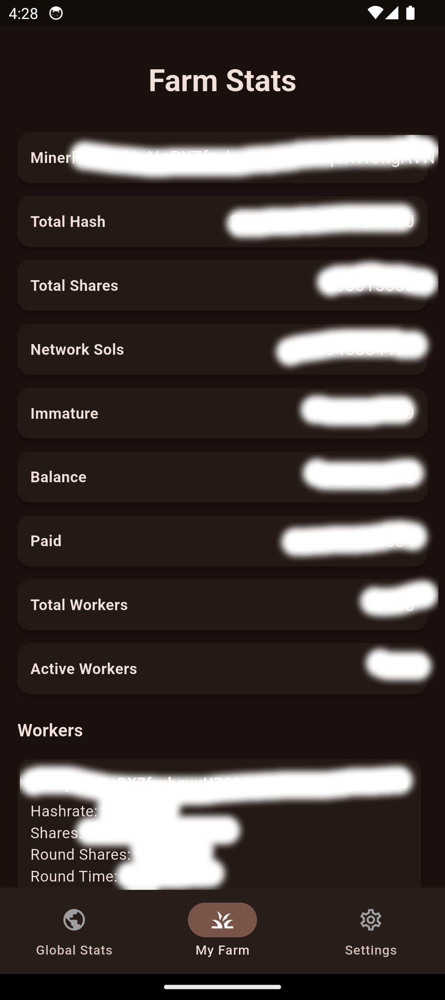

> [!WARNING]
> The project is still under unstable development. Expect bugs and breaking changes
<div align="left">

</div>
M-Verus is an open source android mobile app designed to look for VRSC mining statistics in verus.farm.

## Features
- [x] Global Stats 
- [x] Personal farming stats
- [x] Material 3 colorful themes
- [x] Dark / Light mode
      
## Platforms Support
- [x] Android
- [ ] iOS (less probable)
- [ ] Web (useless)
- [ ] Linux / Windows (useless too)

## Galery
<div align="left">



</div>

## Contributions
Contributions are highly encouraged and welcome. Please feel free to submit issues, pull requests, or discuss ideas. For further discussion, contact deftonish@proton.me

## Donations
- If you wish to help supporting my work, consider donating, small funds are always so caring.
- Bitcoin : ```bc1qfxg9wg97vklzselnayy0eutk5t9cpy048jmzzf```
- Ethereum : ```0x859477061053a5a6a72466fee128fbdff21a34ba```
- Solana : ```UDyMrbQh5LTBXAT3K22jRZCfnLpw4CwztiYcXBtvd4t```
- Verus : ```RWJ67efCytvy2sJewjNQgc4fxjfpWgHUi5```

## License
This project is licensed under the [GNU General Public License v3.0](https://www.gnu.org/licenses/gpl-3.0.html).

## Credits
This project was created and been mantained by [TenebrisOS](https://github.com/TenebrisOS)
